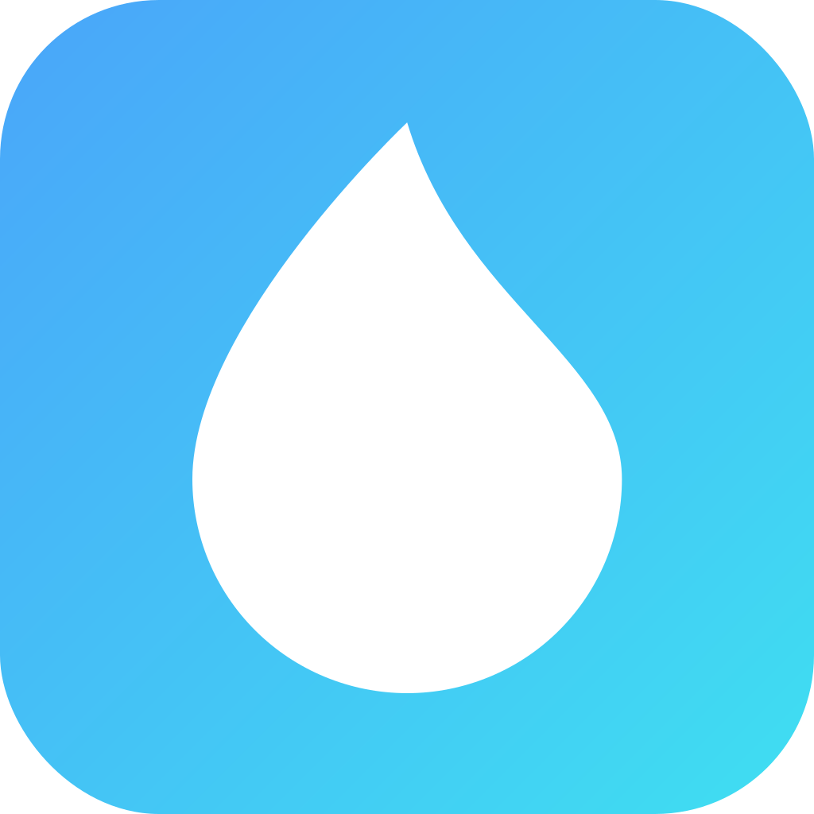
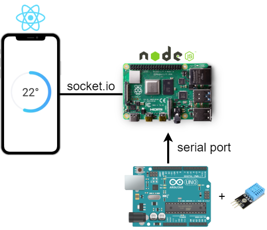

  

<h1 align="center">Aura</h1>

This is made for personal use and only works for devices connected to your network. Feel free to clone and host Aura yourself.

## Structure

| Codebase                                                                   |     Description     |
| :------------------------------------------------------------------------- | :-----------------: |
| [arduino](https://github.com/MaximilianHagelstam/aura/tree/master/arduino) |   Arduino script    |
| [server](https://github.com/MaximilianHagelstam/aura/tree/master/server)   | Raspberry Pi server |
| [mobile](https://github.com/MaximilianHagelstam/aura/tree/master/mobile)   |  React Native app   |

## Architecture

## License

This project is licensed under the terms of the [MIT](https://choosealicense.com/licenses/mit/) license.
